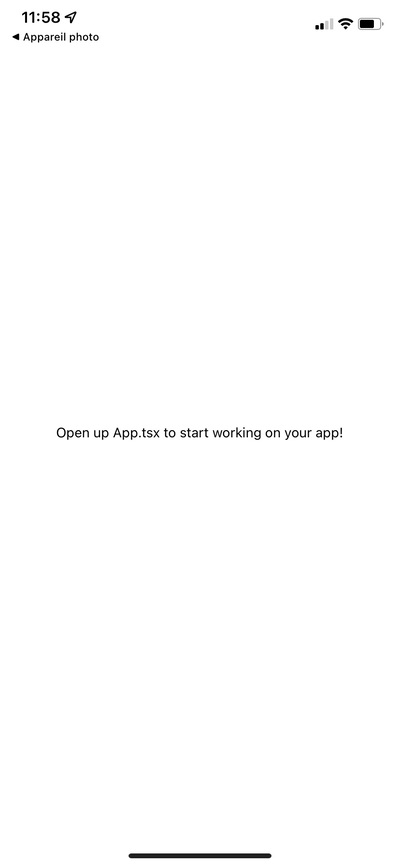

# Workshop React Native: Create a to do list ⚛️
Be sure to install every [prerequisites](./SETUP.md) in order to complete the workshop

In this workshop you will:

- Discover a language that allow you to code application on different platforms
- Discover hooks to replace classes
- Learn how to do animations
- Learn how to use a Typing overlay to correctly use your variables

## What is React-Native

[React Native](https://reactnative.dev) is an open-source UI software framework created by Meta Platforms, Inc.

It's used to develop applications on many operating systems with React framework along with native platform capabilities.

## What is TypeScript

[TypeScript](https://www.typescriptlang.org) is a typed programming language, it helps you to know when you are doing things that you shouldn't with variables (like changing their type when you don't want to) *✨JavaScript✨*.

Try to do the workshop with this overlay, it doesn't change much on a small project like this one but it's a good habit to adopt.

## What is Expo

[Expo](https://expo.dev) is an open-source platform for making universal native apps for Android, iOS, and the web with JavaScript and React.

It's used to easily translate React framework to the native language of your device.

## Step 1 - Create your first Application

Start by creating a Typescript basic app with `expo init MyToDoListApp`. Select the `blank TypeScript` option

Try to launch it on your phone, you should see something like this

## How will we compile ?

We simply have to launch a packager between expo and your phone.

To do this, simply run `expo start`.

If you have an error with @empo/ngrok you might want to run this command `npm install @expo/ngrok@2.4.3`

Press `d` to open developer tools and enable `tunnel mode`.

Then, scan the qr code on your phone to have your new application. (On your camera for iOS and in Expo App for Android)

Congrats ! You created an application !

## Step 2 - Create a basic view around your To Do list

Change the colors and properties of your view to have a basic view that will be around your future todo list.

Add a Title in the upper left corner, try to make it visible but not invasive.

Style your background and your text to make your launching view welcoming for users.

One of the power of React-Native is it's community, developers around the world share packages that you can use in your applications.

A famous one helps you doing a linear gradient for your views, try to install it and use it for your background if you want !

**💡 The most famous is called react-native-linear-gradient but remember, we are using expo**

You can easily have something like this.

## Step 3 - Let's start the To Do list !

Don't imagine a fancy display of all your tasks for now.

In this step, you will just try to get an input from the user and log it when your user presses a button of validation.

To do this, you will need a special Component to receive users input and a button to send it to your list. Use a `TouchableOpacity` instead of a `Button`, it's way more stylable and usable. Add these to the bottom of your screen, as it is in most applications with user inputs

Be sure to always see what you are writing ! A special Component exists to easily move the user input above the keyboard.

React-Native has completely new way to use variables' states. It's called [**hooks**](https://en.reactjs.org/docs/hooks-intro.html). Try to use them to handle the user input, you will need them later in this workshop !

**⚛️ Bonuses**

Have you tried to create an empty task ? One filled with spaces ? You might not want it to create a task in these cases, find a way to handle annoying cases like these.

Try to send the input with the `send` button that you can sometimes see on your keyboard. Find out how to display it and how to handle when it's pressed !

## Step 4 - Display the To Do List in the application

You will still not have a fancy display in this step, but at least you will have one.

First, store every new tasks in an array. *It would be nice to use hooks here too*. You can do a function doing this to improve the lisibility of your code.

**💡 You can pass functions as parameters to other functions, like pointers in C/C++ but pointers are done automtically here !**

Next, try to display them using a Component made for this. Be aware to find a way of making your view Scrollable *or your to do list will not be infinite...* You can do this with a Component made specially for this, or with a Component doing both.

Simply use a `Text` Component to display them. It will not really be good looking but at least, you will see it.

## Step 5 - Time to create your own Component

**Important**

From now you should start to have a heavy main function. If you haven't already, try to refacto your code to make it clearer.

**Next**

Create a new file called `Task.tsx`.

Create your own Component in this file simply by creating a function called `Task`.

Components works exactly like your main view, you just have to assemble different React
Components and they will be displayed each time you call them. Exectly like `View`or `Text`.

You have to find a way to pass the text corresponding to a single task in this Component.

Call this component instead of the `Text` that you use in [Step 3](./README.md#step-3---lets-start-the-to-do-list).

Try to get a similar result as the one in the [Step 4](./README.md#step-4---display-the-to-do-list-in-the-application).

## Step 6 - Upgrade your component

**🤝 It's now time for us to make a cool to do list !**

Use other basic Component to make yours look better.

Start by adding a button at the right of your Component,
it will be used to remove the task from your list. Just log a message of deletion when you press it,
we will do the back end after.

You can also add a square of color at the left of your Component.
For the moment, it will just be used as a style element, you can develop it's functionment
after this workshop, we will not have time to do it now.

**💡 Don't forget to make your text still lisible, it's the main part of your to do list !**

Add a shadow to your Component to make it *floating* on your screen

You should now see a beautiful to do list, only the front end but it looks great !

## Step 7 - Remove taks when they are done

Try to make a function just like the one of the [Step 4](./README.md#step-4---display-the-to-do-list-in-the-application), but this time it will
remove your task from your array.

**⚛️ Bonus**

Imagine pressing the removing button not on purpose... Not cool uh ?
Try to display an alert that waits for a validation from the user 😉

## Step 8 - Add a welcoming page

Your app seems a little bit sad and empty without any tasks, how could you fix that ?

**💡 I know !**, you could add an image in the case that your list is empty ! Instead of trying to display list elements.

React-Native has something called `conditionnal rendering`, use it to accomplish this.

## FINAL STEP

Your keyboard might be over other components when you use it ? A special Component exists to easily move elements over it. Find it and use it.

## 🎉 Congratulations !

**📱 You now have a beautiful functionnal ToDo list application available on both Android and iOS that you can use to organize your work sessions at Epitech !**

There is still plenty more to learn about react-native, participating to community packages is a good start.

If you want to use an easier package manager in the future, think of [React-native Cli](https://reactnative.dev/docs/environment-setup)

A couple of problems made me choose Expo instead of this client:
- React-Native Cli allows you to test your application on iOS only if you have a MacOS operating system.
- It's longer to setup.

Some benefits are:
- More packages are available.
- The navigation between screens is easier.
- Apps are available 3 days (on iOS at least) without the packager running next to you. You can use your app easily !

## To go further

It seems a bit sad without any animation don't you think ? It's ok if you don't want to,
you worked well but if you want to improve your applications with a few little steps you can !

Add animations to smooth every adding or removing tasks, it will make it cleaner and your app will step up easily.
React-Native has a Framework to make easy animations. Check [this page](https://reactnative.dev/docs/animations) to know every thing about animations.

## Authors

| [ Johan CHRILLESEN](https://github.com/JohanCDev) |
| :---: |
